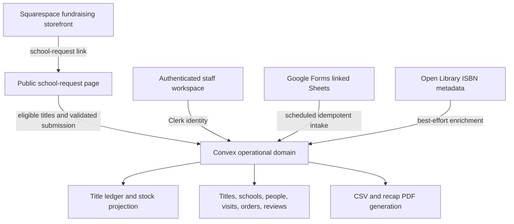
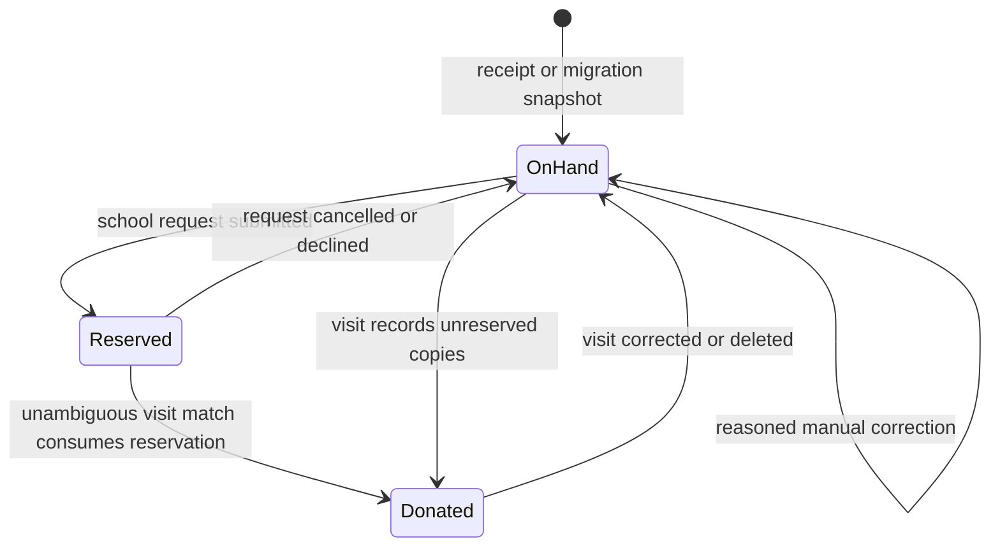

# Joy for Books Book Operations - Plan

## Goal Capsule

- **Objective:** Replace Notion as Joy for Books' operational system of record with a hosted, multi-user book-operations app whose inventory count and school-request availability can be trusted.
- **Product authority:** The COO owns ongoing maintenance. The product is a purpose-built operations system, not a sales CRM or fulfillment suite.
- **Execution profile:** Build a greenfield Next.js web application deployed on Vercel, with Clerk authentication and Convex as the operational database and backend.
- **Stop conditions:** Do not add sales pipelines, fulfillment, a Squarespace Commerce integration, or shared inventory with fundraising merchandise. Escalate a conflict with the Product Contract rather than inventing a new operational workflow.
- **Tail ownership:** The executor owns implementation, migration rehearsal, automated verification, deployment validation, and concise operator documentation.

---

## Product Contract

### Summary

Build a custom web application centered on book titles and title-level inventory.
Each title brings together its catalog identity, stock, suppliers, orders, receipts, school requests, reviews, and school-visit history; people, schools, and visits remain important connected records.
A public school-request page, linked from Squarespace, lets schools reserve in-stock donation titles without exposing the staff CRM.

### Problem Frame

Joy for Books currently tracks people, schools, books, visits, requests, and follow-ups across disconnected Notion databases.
Reconciling a school visit has taken hours because donations, readers, stock, and title counters must be updated independently.

The organization’s recurring operating need is broader than a visit: it must know what each title is, how many copies are on hand and available to request, where copies came from, which supplier can provide them, and where they went.
When that context is fragmented, purchase and donation decisions depend on unreliable manual reconciliation.

### Key Decisions

- **Books are the product spine.** A title is the durable operational center; orders, receipts, reviews, requests, and visits explain how it moves through the organization. (session-settled: user-approved — chosen over a school-visit spine: trusted inventory and title context are the more frequent operating need.)
- **Build a focused custom product.** The app replaces the operational layer of Notion and can evolve with Joy for Books' workflows. (session-settled: user-approved — chosen over a configurable SaaS CRM: future flexibility outweighs the accepted maintenance responsibility.)
- **Use three shared-data work surfaces.** Table, board, and timeline views are first-class views over the same records rather than separate systems. (session-settled: user-approved — chosen over a narrower view set: the COO relies on each to work flexibly.)
- **Make inventory auditable.** Receipts, donations, reservations, releases, and reasoned manual corrections form a title’s stock history; derived counters are not independently edited.
- **Use an organization-wide low-stock threshold.** Crossing the default threshold automatically flags a title for review. (session-settled: user-directed — chosen over per-title thresholds: v1 needs one simple default.)
- **Separate school requests from fundraising commerce.** Squarespace continues to sell fundraising items, while a Vercel-hosted school-request page handles only donation-title requests. (session-settled: user-approved — chosen over routing all commerce through the custom app: fundraising storefront behavior remains intact.)
- **Reserve on submission.** A school representative’s completed request immediately reserves available copies; the COO releases the reservation only when cancelling or declining it. (session-settled: user-approved — chosen over approval-time reservation: availability must be accurate when the school submits.)
- **Keep the product out of sales and fulfillment.** It must not become an opportunity pipeline, shipping tool, or generic CRM.

### Actors

- A1. **Chief operating officer:** Primary operator and ongoing product owner; maintains catalog, inventory, orders, requests, and reports.
- A2. **Trusted collaborator:** One or two additional authenticated users who can enter and update operational records with the same permissions as the COO.
- A3. **School representative:** Principal or teacher who submits a book request without a CRM account.
- A4. **Reader:** Person participating in a school visit; does not sign in.
- A5. **Reviewer:** Person submitting a book review; does not sign in.
- A6. **Supplier:** Distributor from which the organization orders books.
- A7. **Squarespace storefront:** Public fundraising storefront and referral point for the custom school-request page; it is not a CRM data source.
- A8. **Google Forms and linked Sheets:** External source of donation applications and book reviews.

### Requirements

**Book catalog and workspace**

- R1. The system stores each book as a title record with title, author, and ISBN required before it enters inventory.
- R2. A title supports an editable cover image, synopsis, notes, purchase information, and one or more supplier references.
- R3. Entering an ISBN attempts to prefill title, author, cover, and synopsis data while allowing the operator to edit the result.
- R4. A balanced title workspace shows catalog identity, current stock state, available-to-request quantity, the low-stock review state, and recent operational history together.
- R5. The system provides focused title sections for inventory, requests and visits, reviews, and suppliers or orders.

**Inventory and purchasing**

- R6. The system tracks quantity-on-hand for each title and automatically flags it for review when it falls below one organization-wide default threshold.
- R7. An operator can mark a flagged title as needing reorder and create a supplier order from that decision.
- R8. A supplier order selects one supplier and can contain multiple titles with quantities.
- R9. Supplier orders support needed, ordered, and received progress, and a title can appear in orders from different suppliers.
- R10. The operator records received quantity per title, including partial deliveries, and receiving automatically increases quantity-on-hand.
- R11. The operator can adjust quantity-on-hand directly only with a reason; the adjustment appears in the title’s operational history.
- R12. The system preserves an auditable history of receipts, donations, reservations, releases, and manual adjustments for each title.

**School requests and connected operations**

- R13. The system stores schools separately from people and lets each school have one or more staff contacts and a relationship history.
- R14. The system stores people with multiple role tags, including donor, professional contact, volunteer, school staff, board member, reader, and reviewer.
- R15. The system stores school visits as records linking a school, staff present, readers, books read aloud, books donated with quantities, and follow-up details, with inline creation of missing schools, people, and books during visit logging.
- R16. Saving a visit automatically decrements each donated title’s quantity-on-hand and consumes matching active reservations for the same school and title without asking staff to link the request; editing or deleting the visit reverses and reapplies both effects correctly.
- R17. Per-person participation and per-title read or donation counts are derived from visits rather than independently editable fields.
- R18. The event board helps the operator move school-visit work through reader confirmation, school-official contact and follow-up, and securing books for the site.
- R19. A public school-request page lists only requestable titles with available copies and accepts a school representative’s contact details, normalized school name and address, and requested title quantities; it automatically attaches a matching school record when available.
- R20. Submitting a valid school request atomically creates its connected records and reserves the requested copies, reducing available-to-request quantity without reducing quantity-on-hand.
- R21. The COO can cancel or decline a request and release its active reservations, and has an age-sorted active-request queue plus a reservation-exception queue for ambiguous matches or shortages; a visit donation remains the only action that physically decrements stock.

**Flexible views**

- R22. The system provides a table view for manual entry, creating records, and adapting the displayed columns to the operator’s task.
- R23. The system provides a board view for school-visit preparation and follow-up.
- R24. The system provides a timeline view for supplier ordering, expected delivery, receipt, and other date-based book operations.

**Reviews and intake**

- R25. The system stores book reviews with a reviewer, free-text feedback, and numeric rubric score.
- R26. The operator can approve or exclude review feedback for manual Squarespace copy-paste; all rubric scores still feed the popularity report.
- R27. Google Form donation applications and book reviews enter the CRM without manual copy-paste.
- R28. Unmatched Google Form intake becomes a pending item that an operator can attach to an existing record or use to create the missing school, person, book, or review relationship.

**Reports, access, migration, and hosting**

- R29. The system generates a shareable school-visit recap PDF containing the school, staff present, readers, books read, books donated with quantities, and follow-up record.
- R30. The system provides a Book Popularity report with independent request-count, donation-count, and average-rubric-score columns that can be sorted or filtered independently and exported to CSV; PDF export is included where useful.
- R31. All staff CRM data and operations require authentication. The public request route exposes only requestable-title fields and a narrowly scoped submission capability. V1 supports one to three staff accounts with the same effective permissions.
- R32. Migration creates one opening-balance movement per title from the current physical inventory snapshot, imports approximately six to twelve months of relevant people, schools, catalog records, requests, visits, and reviews as historical context without stock effects, and imports only verified active reservations into availability.
- R33. Notion remains a read-only historical archive for data not imported; the CRM does not sync back to Notion.
- R34. The system is deployed at a publicly reachable hosted URL.
- R35. Squarespace fundraising products use separate inventory and remain outside the CRM; the CRM neither reads Commerce orders nor writes inventory back to Squarespace.
- R36. CRM operational records are retained indefinitely, while raw Google Form intake payloads are purged after 180 days; routine logs and exports do not expose unnecessary personal data.
- R37. When a physical adjustment or unreserved donation reduces quantity-on-hand below active reservations, the system retains the truthful movement, blocks additional availability, and creates a COO-visible exception until affected reservations are resolved.
- R38. Public and staff workflows provide semantic labelled controls, keyboard operation, announced status changes, focused validation errors and confirmations, and responsive layouts appropriate to the task.

### Key Flows

- F1. **Manage inventory and begin a reorder**
  - **Trigger:** The COO opens a title with a low-stock flag.
  - **Actors:** A1, A6.
  - **Steps:** Review the title’s current stock and history; mark reorder as needed; choose a supplier; add the title and any other needed titles to one supplier order.
  - **Outcome:** The title remains traceable from low-stock review through supplier order and receipt.
  - **Covered by:** R4, R6, R7, R8, R9, R12.

- F2. **Receive a supplier order**
  - **Trigger:** A shipment arrives, fully or partially.
  - **Actors:** A1, A6.
  - **Steps:** Open the supplier order; record received quantity for each delivered title; leave undelivered quantities outstanding when needed.
  - **Outcome:** Quantity-on-hand and title history reflect exactly what arrived.
  - **Covered by:** R9, R10, R12.

- F3. **Submit a school book request**
  - **Trigger:** A school representative follows the request link from Squarespace.
  - **Actors:** A3, A7.
  - **Steps:** View the live list of requestable titles; select available quantities; provide normalized school name, address, and contact details; submit the request.
  - **Outcome:** The school request and its reservations are recorded atomically, and the next representative sees reduced availability.
  - **Covered by:** R19, R20, R31, R35.

- F4. **Record a school visit**
  - **Trigger:** A1 or A2 records a completed visit.
  - **Actors:** A1, A2, A3, A4.
  - **Steps:** Select or create the school, people, and books without leaving the draft; record readers, books read, donated quantities, and follow-up details; save.
  - **Outcome:** The visit becomes part of each involved title’s history, inventory and any unambiguous matching reservation effects change atomically, and a recap is ready to generate.
  - **Covered by:** R13, R14, R15, R16, R17, R21, R29, R37.

- F5. **Resolve Google Form intake**
  - **Trigger:** An application or review submission cannot be matched automatically.
  - **Actors:** A1, A8.
  - **Steps:** Review the pending item; attach it to an existing record or create the missing record from the item; complete the relationship.
  - **Outcome:** No supported form intake is silently dropped or requires manual re-entry.
  - **Covered by:** R27, R28.

### Acceptance Examples

- AE1. **Covers R6, R7.** Given a title with 14 copies on hand and a default low-stock threshold of 15, when its count reaches 14, then it is automatically flagged for review; when the COO marks reorder needed, then it can be added to a supplier order.
- AE2. **Covers R8, R9, R10.** Given an order containing two titles from one supplier, when only part of one title’s quantity arrives, then the received count for that title increases inventory and the remaining quantity stays outstanding on the order.
- AE3. **Covers R11, R12.** Given a title with 25 copies on hand, when the COO corrects it to 23, then the title history records the adjustment and its reason.
- AE4. **Covers R15, R16, R17.** Given a title with 25 copies on hand, when a visit donates 20 copies with two readers, then inventory becomes 5 and the title and reader-derived counters reflect that visit; when the visit is deleted, then inventory and counters revert.
- AE5. **Covers R19, R20, R21.** Given a title with 10 copies on hand and no active reservations, when a school submits a request for 6 copies, then available-to-request becomes 4 while quantity-on-hand remains 10; when the COO declines the request, then availability returns to 10.
- AE6. **Covers R28.** Given a Google Form submission that matches no school, person, or title, when the operator creates the missing record from the pending item, then the submission is attached to that newly created record rather than dropped or re-entered.
- AE7. **Covers R30.** Given the popularity report, when the operator sorts by average rubric score, then request and donation counts remain visible and independently sortable.
- AE8. **Covers R16, R21.** Given a school has one active request reserving 6 copies of a title, when a visit for that school donates 4 copies, then inventory decreases by 4 and the reservation decreases to 2 without staff linking the request; if multiple matching active requests exist, then the donation is recorded and the request exception queue requires COO resolution.
- AE9. **Covers R37.** Given 6 copies are reserved and a reasoned correction sets quantity-on-hand to 4, when the adjustment is saved, then availability remains unavailable for new requests and the affected reservation appears in the COO exception queue.

### Success Criteria

- The COO trusts quantity-on-hand without recurring manual reconciliation for the first three months after launch.
- A low-stock title can move from review to a recorded supplier order without a side spreadsheet.
- A completed school request never promises copies that are no longer available to request.
- Receiving, donating, editing, deleting, reserving, or releasing operational events never leaves contradictory inventory or derived counters.
- Logging a school visit and producing its recap takes under 15 minutes end-to-end.
- New school requests, donation applications, and reviews reach the CRM without manual copy-paste.

### Scope Boundaries

**Deferred for later**

- Per-title low-stock thresholds, supplier price comparison, and automated purchase ordering.
- Volunteer self-service, school portals, multi-role permissions, mobile or offline-first entry, donor giving-history reports, and thank-you packet generation.
- Full historical Notion migration; records older than the initial import remain in the Notion archive.
- Automated publishing of approved reviews or inventory changes to Squarespace.

**Outside this product's identity**

- Sales pipelines, opportunities, lead qualification, and “closed won” stages.
- Pick-pack-ship fulfillment, shipping labels, and general distributor-management workflows.
- Squarespace Commerce order ingestion, checkout, payment processing, or synchronization with fundraising merchandise inventory.
- A generic CRM that requires the COO to reconcile separate operational systems.

### Dependencies / Assumptions

- Squarespace can host a clear call-to-action linking school representatives to the custom request page, without using its Commerce API.
- Google Form submissions can be read from their linked Google Sheets without manual export.
- An ISBN lookup source can supply catalog metadata for at least many titles; the operator can complete or correct missing data.
- The COO can provide clean Notion exports and a launch-date physical inventory count.
- The COO sustains routine ownership of hosting, integrations, maintenance, and access for the hosted application.
- A custom Vercel domain is available for the staff app and public request page because Clerk does not support the default Vercel deployment domain.

### Outstanding Questions

**Deferred to Implementation**

- Choose the precise PDF library after confirming Vercel runtime compatibility and desired recap styling.
- Choose the production anti-automation control for the public request submission after reviewing expected request volume and operating support capacity.
- Decide which historical request records are imported as fulfilled versus retained only in Notion when source data does not identify title quantities reliably.

### Sources / Research

- `docs/brainstorms/2026-05-09-joy-for-books-crm-requirements.md` — original event-first v1 brief; this plan supersedes its product framing while retaining compatible requirements.
- [Convex with Clerk](https://docs.convex.dev/auth/clerk) and [Convex on Vercel](https://docs.convex.dev/production/hosting/vercel) — authentication boundary and deployment constraints, including the custom-domain requirement for Clerk.
- [Convex cron jobs](https://docs.convex.dev/scheduling/cron-jobs) — scheduled Google Sheets intake should run with Convex’s scheduling model and idempotent processing.
- [Squarespace Commerce Orders API](https://developers.squarespace.com/commerce-apis/orders-overview) — Core-plan API access is unavailable, so it is deliberately not an intake dependency.
- [Open Library Books API](https://openlibrary.org/dev/docs/api/books) — ISBN metadata lookup source with an editable operator fallback.

---

## Planning Contract

### Product Contract Preservation

The prior requirements-only contract remains the authority for the book-centered operating model, inventory, suppliers, visits, views, reviews, migration, and scope boundaries.
The confirmed Squarespace change rewrites the former Commerce-order intake behavior: R24-R25 and F4 from the earlier draft are now represented by R19-R21, R27-R28, F3, and F5; R26-R28 and the former success criterion are updated to distinguish public school requests from Google Form intake.
This is a confirmed product change, not a technical substitution: Squarespace fundraising commerce stays intact, while the school-request experience moves to the custom app because the Core plan does not expose Commerce API access.

### Key Technical Decisions

- KTD1. **Use Next.js on Vercel, Clerk, and Convex as one hosted application boundary.** Next.js supplies both the staff interface and the public request route; Clerk controls staff identity; Convex owns operational state and mutations. This matches the user’s selected stack and keeps inventory transactions close to their consistency boundary.
- KTD2. **Model stock as an append-only operational ledger plus a transactionally maintained title projection.** Receipts, manual adjustments, visit donations, reservations, releases, and automatic reservation consumption create traceable movements. The projection exposes `quantityOnHand`, active reserved quantity, and available-to-request quantity so the UI never edits a counter in isolation.
- KTD3. **Keep request reservations separate from physical depletion while consuming unambiguous matches automatically.** A successful public request reserves stock immediately, but only a school-visit donation changes quantity-on-hand. A visit consumes an active reservation only when school and title matching are unambiguous; otherwise the COO resolves the exception. (session-settled: user-approved — chosen over approval-time reservation: the school’s submitted request must reserve copies immediately.)
- KTD4. **Use a custom public request page and retain Squarespace only for fundraising commerce.** The request page is linked from Squarespace and reads the live requestable-title list from Convex. No Squarespace Commerce orders, product updates, or inventory sync enter the CRM. (session-settled: user-approved — chosen over an API-backed Squarespace request feed: Core-plan access is unavailable and fundraising commerce must remain unchanged.)
- KTD5. **Use Convex scheduled actions for Google Sheets intake with durable source identity and idempotency.** Use a COO-owned, least-privilege Google integration identity shared read-only with approved Sheets; store source row identity, a payload fingerprint, processing state, and the resulting record or pending item. Credentials live only in managed environment configuration, with documented rotation, revocation, and redacted logs.
- KTD6. **Treat ISBN lookup as a best-effort enrichment, never a catalog authority.** Query Open Library on ISBN entry, preserve the returned source metadata for traceability, and require the operator to confirm or edit every field before saving.
- KTD7. **Enforce staff membership in backend functions as well as the web route shell.** Clerk protects staff navigation, while a Convex allowlist of approved Clerk identities gates every staff-facing query and mutation. Public reads return only requestable-title data; the Vercel route calls the protected Convex submission surface with a managed server-to-server secret, so direct public mutation calls are rejected.

### High-Level Technical Design

The design separates public request traffic, authenticated staff work, and external intake while holding all operational consequences in Convex.
The diagram is a planning model rather than an endpoint or schema specification.

**Inventory and reservation lifecycle**

The implementation must treat a request, its reservation rows, and availability check as one atomic mutation.
Visit edits and deletions must reverse their prior donation and automatic-reservation-consumption movements before applying revised movements in the same transaction boundary.

### System-Wide Impact

- **Data integrity:** Every inventory-affecting event must have an immutable movement record, a source reference, and an idempotency strategy where it crosses a process boundary. A shortage against active reservations remains visible and unavailable until the COO resolves it.
- **Availability:** Availability is derived from on-hand stock less active reservations; it is not Squarespace product availability and must never affect fundraising merchandise.
- **Authentication:** Public access is an intentional narrow exception for the school-request route. All staff data, reports, and staff-facing mutations remain backend-authorized through Clerk identity; validated school-request submission is the sole public mutation exception.
- **Privacy and operations:** CRM records remain indefinitely, raw form payloads purge after 180 days, and logs exclude credentials and unnecessary personal data. The COO needs visible pending intake, failed intake attempts, source links, reservation exceptions, and a repeatable import preview so routine maintenance does not require engineering access.

### Risks and Mitigations

| Risk | Mitigation |
| --- | --- |
| Concurrent school requests could reserve the same copies. | Make the availability check and reservation creation one Convex transaction and test simultaneous submission against the same title. |
| Edits or deletes could double-count a visit or reservation. | Give each donation and automatic reservation-consumption movement a stable event reference and reverse/reapply both atomically. |
| Physical stock could fall below reservations. | Preserve the truthful movement, block new availability, and make the affected reservations a COO-visible exception. |
| Google Sheets polling could replay, reorder, or lose access. | Retain source identity and payload fingerprint; use a COO-owned least-privilege integration identity with documented sharing, rotation, revocation, and staging preflight. |
| Public request submission could be abused. | Validate all fields server-side, add a honeypot and rate control at launch, keep public reads minimal, and require the Vercel-to-Convex submission secret. |
| ISBN metadata may be incomplete or wrong. | Keep lookup data editable and never overwrite a staff-confirmed catalog value automatically. |
| Clerk deployment can fail on the default Vercel domain. | Configure and verify a custom production domain before inviting staff. |

### Sequencing

Build the authenticated foundation and canonical data model first, then prove the ledger and order flows before exposing school-request reservations.
Complete people, schools, visits, and donation movements in U6 before completing U5’s visit board; U5 otherwise follows the stock and request foundations.
Add reports, external intake, metadata enrichment, and migration rehearsal after the canonical staff flows exist.
Deploy only after the production domain, Clerk configuration, Google authorization, and a physical inventory reconciliation have passed the Verification Contract.

---

## Implementation Units

### U1. Establish the hosted application, identity boundary, and development baseline

- **Goal:** Create the greenfield Next.js, Clerk, Convex, and Vercel foundation with a public request route and staff-only application shell.
- **Requirements:** R31, R34, R38.
- **Dependencies:** None.
- **Files:** `package.json`, `tsconfig.json`, `next.config.ts`, `convex.json`, `.env.example`, `.gitignore`, `app/layout.tsx`, `app/providers.tsx`, `app/page.tsx`, `app/request-books/page.tsx`, `app/(staff)/layout.tsx`, `proxy.ts`, `convex/auth.config.ts`, `vercel.json`, `tests/auth-boundary.test.ts`, `e2e/navigation.spec.ts`.
- **Approach:** Configure a single deployment with distinct public and staff route groups. Keep Clerk provider configuration and Convex identity configuration aligned, introduce shared accessible interaction standards, and establish lint, unit-test, and browser-test scripts before feature work.
- **Test scenarios:** An unauthenticated visitor reaches the public request page but cannot reach staff screens; an approved staff identity reaches the workspace; a signed-in identity absent from the staff allowlist is rejected; required deployment variables are documented without secrets; baseline controls support labels, keyboard navigation, focus management, status announcements, and responsive layouts.
- **Verification:** Run the planned lint, unit, and browser smoke-test scripts; deploy a preview and confirm the public and staff route boundaries behave as expected.

### U2. Define the canonical Convex domain and authorization helpers

- **Goal:** Establish the schema, indexes, identity checks, and shared availability rules that every feature uses.
- **Requirements:** R1, R2, R4, R6, R12, R13, R14, R31, R35, R37.
- **Dependencies:** U1.
- **Files:** `convex/schema.ts`, `convex/lib/auth.ts`, `convex/lib/availability.ts`, `convex/lib/validation.ts`, `convex/titles.ts`, `convex/people.ts`, `convex/schools.ts`, `convex/inventory.ts`, `tests/domain-schema.test.ts`, `tests/authorization.test.ts`.
- **Approach:** Define canonical title, supplier, order, inventory movement, reservation, school request, person, school, visit, review, and pending-intake records with indexes for title history and active availability. Put staff allowlist authorization and public-data projection rules in shared backend helpers rather than relying on UI checks.
- **Test scenarios:** Staff mutations require an approved identity; a signed-in nonstaff identity is denied all staff queries and mutations; public title data omits staff-only notes and history; a title’s available quantity is on-hand minus active reservations; invalid role tags, quantities, and source references are rejected; a shortage creates no new availability.
- **Verification:** Run schema and authorization tests against a disposable Convex deployment; inspect generated indexes and confirm all later units can query by title, source record, and active status.

### U3. Implement inventory ledger, suppliers, orders, and receipts

- **Goal:** Make the stock count and procurement workflow auditable before staff can rely on it operationally.
- **Requirements:** R2, R6-R12, R37.
- **Dependencies:** U2.
- **Files:** `convex/inventory.ts`, `convex/suppliers.ts`, `convex/orders.ts`, `convex/titles.ts`, `app/(staff)/inventory/page.tsx`, `app/(staff)/orders/page.tsx`, `components/inventory/stock-history.tsx`, `components/orders/order-editor.tsx`, `tests/inventory-ledger.test.ts`, `tests/order-receipts.test.ts`.
- **Approach:** Record receipts and reasoned corrections as immutable movements, update the title projection transactionally, and derive low-stock review status from the organization default. Model supplier orders with one supplier and many line items; retain outstanding quantity until each partial receipt is recorded.
- **Test scenarios:** A title below the default threshold is flagged; a flagged title becomes reorder-needed; a single-supplier order accepts multiple titles; partial receipt increments only the delivered quantity; manual correction without a reason fails; a correction below active reservations creates a shortage exception and no new availability; history explains the resulting stock.
- **Verification:** Run the ledger and receipt test suites, then complete the three acceptance examples for stock review, partial receipt, and manual correction in a seeded staff environment.

### U4. Build the public school-request flow and atomic reservation handling

- **Goal:** Let schools request live in-stock donation titles without accessing CRM records or disrupting Squarespace fundraising commerce.
- **Requirements:** R4, R19-R21, R31, R35, R37, R38.
- **Dependencies:** U1, U2, U3.
- **Files:** `app/request-books/page.tsx`, `app/api/school-requests/route.ts`, `components/requests/request-form.tsx`, `components/requests/requestable-title-list.tsx`, `convex/schoolRequests.ts`, `convex/http.ts`, `convex/lib/availability.ts`, `app/(staff)/requests/page.tsx`, `tests/school-request-reservations.test.ts`, `e2e/public-request.spec.ts`.
- **Approach:** Serve a minimal public projection of requestable titles and send submissions through a validated Vercel route to one atomic Convex operation protected by a server-to-server secret. Normalize school name and address to attach an existing school automatically; make uncertain matches visible to the COO. Create reservation movements and provide an age-sorted active-request queue with cancellation, decline, and exception resolution.
- **Test scenarios:** Out-of-stock and fully reserved titles never appear publicly; a successful request lowers availability but not on-hand stock; two competing submissions cannot over-reserve; cancellation restores availability; a matching normalized school attaches automatically; direct calls without the server credential are rejected; loading, validation, concurrent-unavailability, duplicate-submit, success-reference, and release-feedback states are accessible and clear.
- **Verification:** Run unit concurrency coverage and browser tests from the public form through staff confirmation; manually confirm Squarespace can link to the custom route without altering its fundraising checkout.

### U5. Deliver the book-centered staff workspace and flexible views

- **Goal:** Give staff a practical home for title data, stock state, history, and all three shared-data views.
- **Requirements:** R1-R5, R22-R24.
- **Dependencies:** U2, U3, U4, U6.
- **Files:** `app/(staff)/books/page.tsx`, `app/(staff)/books/[titleId]/page.tsx`, `app/(staff)/views/page.tsx`, `components/books/title-workspace.tsx`, `components/books/title-form.tsx`, `components/views/table-view.tsx`, `components/views/visit-board.tsx`, `components/views/operations-timeline.tsx`, `convex/titles.ts`, `convex/views.ts`, `convex/integrations/openLibrary.ts`, `tests/title-workspace.test.ts`, `tests/isbn-enrichment.test.ts`, `e2e/staff-views.spec.ts`.
- **Approach:** Use the canonical queries from U2 rather than per-view copies of data. Support editable title metadata and supplier references, use an editable Open Library result for ISBN enrichment, give the title workspace focused sections, and persist only user-facing view configuration rather than duplicate records.
- **Test scenarios:** Creating a title requires title, author, and ISBN; an ISBN lookup can be corrected before save; table columns can be selected for manual entry; board cards reflect visit milestones after U6 provides visit records; timeline contains supplier ordering and receipt dates; title stock and request availability agree with the ledger; table, board, and timeline controls are keyboard-operable and announce status changes.
- **Verification:** Run title workspace tests and browser checks across table, board, and timeline views with seeded title, order, request, and visit records.

### U6. Implement connected people, schools, visits, and donation movements

- **Goal:** Record school relationships and visits efficiently while maintaining correct physical stock and derived participation history.
- **Requirements:** R13-R18, R21, R29, R37, R38.
- **Dependencies:** U2, U3, U4.
- **Files:** `convex/people.ts`, `convex/schools.ts`, `convex/visits.ts`, `app/(staff)/people/page.tsx`, `app/(staff)/schools/page.tsx`, `app/(staff)/visits/page.tsx`, `app/(staff)/visits/[visitId]/page.tsx`, `components/visits/visit-editor.tsx`, `components/visits/inline-create.tsx`, `tests/visit-inventory-effects.test.ts`, `tests/visit-participation.test.ts`, `e2e/visit-entry.spec.ts`.
- **Approach:** Store people and schools as separate records with role tags and relationships. Allow inline creation from the visit editor, then make visit save, edit, and delete create or reverse stable donation and automatic reservation-consumption movements transactionally; derive reader and title participation from visit data. Consume a reservation only when the school/title match is unambiguous; leave every other case for the COO exception queue.
- **Test scenarios:** A new school, staff contact, reader, and title can be created while logging a visit; a visit donation lowers on-hand stock once; an unambiguous matching reservation is consumed without staff linking it; an ambiguous match becomes an exception; edit replaces rather than adds a prior movement; delete restores stock and reservation; reader and title counts update from the visit.
- **Verification:** Run visit inventory and participation tests, then execute the visit acceptance example in browser with a seeded title and verify the recap data model is complete.

### U7. Add reviews, reports, exports, and visit recap PDFs

- **Goal:** Turn operational records into review moderation, usable reporting, exportable data, and a shareable visit recap.
- **Requirements:** R25, R26, R29, R30.
- **Dependencies:** U2, U4, U6.
- **Files:** `convex/reviews.ts`, `convex/reports.ts`, `app/(staff)/reviews/page.tsx`, `app/(staff)/reports/page.tsx`, `app/(staff)/visits/[visitId]/recap/route.ts`, `components/reviews/review-moderation.tsx`, `components/reports/popularity-report.tsx`, `lib/exports/csv.ts`, `lib/exports/visit-recap.ts`, `tests/popularity-report.test.ts`, `tests/visit-recap.test.ts`, `e2e/reports.spec.ts`.
- **Approach:** Keep review moderation separate from scoring so exclusion affects publication eligibility but not the report. Derive request and donation counts from canonical request and visit data, export the visible report data to CSV, and render visit recaps from the same visit query that drives staff detail.
- **Test scenarios:** A review can be excluded while its score remains in the average; each popularity column sorts independently; request reservations count once per submitted request; CSV preserves current filtered rows; recap output contains required school, people, books, quantities, and follow-up details; report and review controls have labelled, keyboard-operable, responsive interaction states.
- **Verification:** Run report and recap tests; open generated CSV and PDF artifacts from a seeded browser flow and compare their contents with the source staff record.

### U8. Integrate Google Sheets intake, ISBN enrichment, migration, and operating controls

- **Goal:** Replace manual intake and prepare a safe, repeatable launch from Notion exports and a physical count.
- **Requirements:** R27, R28, R32-R34, R36.
- **Dependencies:** U1, U2, U5, U6, U7.
- **Files:** `convex/crons.ts`, `convex/intake.ts`, `convex/http.ts`, `convex/integrations/googleSheets.ts`, `convex/migrations/notionImport.ts`, `app/(staff)/intake/page.tsx`, `app/(staff)/settings/page.tsx`, `components/intake/pending-item.tsx`, `scripts/import-notion.ts`, `docs/operations/launch-and-maintenance.md`, `tests/google-sheets-intake.test.ts`, `tests/notion-import.test.ts`.
- **Approach:** Poll linked Sheets through a Convex schedule using the COO-owned least-privilege integration identity, retain source identity and processing status, and turn unmatched data into pending items that can attach or create records. Require an approved Sheet and tab identifier, field mapping, and read-access grant before enabling a feed. Purge raw payloads after 180 days while retaining the resolved CRM record and redacting logs. Make import dry-run first, create opening-balance movements from the trusted physical count, import pre-cutover history without new stock effects, and then reconcile before enabling the public request page.
- **Test scenarios:** Repeated or reordered source rows do not duplicate intake; a missing Sheet configuration fails visibly; unmatched form data becomes a resolvable pending item; resolving from a pending item attaches the original source; raw payload cleanup preserves its resolved record; migration dry-run reports invalid rows without writing; opening balances match the supplied physical inventory snapshot and historical visits do not double-count stock.
- **Verification:** Run integration and migration tests using fixtures; complete a staging intake replay with the production credential model and mapping; verify scheduled-job failures, unresolved pending items, and retention cleanup are visible to staff; deploy to the custom Vercel domain and validate Clerk production authentication.

---

## Verification Contract

| Gate | Planned command or activity | Applies to | Passing outcome |
| --- | --- | --- | --- |
| Static checks | `npm run lint` and `npm run typecheck` | Every unit | No lint or type errors. |
| Domain tests | `npm run test -- --runInBand` | U2-U8 | Ledger, reservations, authorization, intake, migration, and report scenarios pass. |
| Browser tests | `npm run test:e2e` | U1, U4-U7 | Public request, staff workspace, views, visit entry, and reporting paths pass in a browser. |
| Convex integration | `npx convex dev` with test deployment | U2-U8 | Schema, Clerk identity, scheduled intake, and transactional mutations work against Convex. |
| Migration rehearsal | Dry-run then staging import from representative Notion exports | U8 | Invalid records are reported, totals reconcile, and the import can be rerun without duplicate operational movements. |
| Production readiness | Vercel preview then custom-domain production validation | U1, U8 | Clerk works on the real domain; Squarespace link reaches the request page; no fundraising inventory or checkout behavior changes. |

The executor must add the named package scripts as part of U1 and keep the above commands accurate if the chosen test runner requires an equivalent invocation.

---

## Definition of Done

- The deployed application satisfies R1-R38 and the acceptance examples through automated tests or documented production validation.
- Staff access is authenticated and authorized at both the web and Convex boundaries through the approved staff allowlist; the public route exposes only requestable-title data and uses a server-to-server protected submission boundary.
- Every receipt, manual adjustment, school-request reservation, release, automatic reservation consumption, and visit donation produces an auditable title-history entry with no double-counting after edit, delete, retry, or replay.
- The title workspace, table, board, and timeline operate over the same canonical records.
- The school-request page preserves Squarespace fundraising commerce as a separate experience and does not require Squarespace API access.
- Google Sheets intake is idempotent, least-privilege credentialed, correctly mapped, and visible when it fails; raw payloads purge after 180 days and the COO can resolve a pending item without re-entering its information.
- A migration rehearsal creates and reconciles opening balances against the trusted physical inventory snapshot before production cutover, without replaying historical records into stock.
- Reservation shortages, ambiguous automatic matches, and stale active requests are visible to the COO and cannot make additional titles requestable.
- The custom Vercel domain, Clerk production configuration, environment variables, operator guide, and launch checks are complete.
- Linting, type checks, domain tests, browser tests, and deployment validation pass.
- Abandoned experiments, unused integration code, temporary fixtures, and obsolete documentation are removed before handoff.

## Appendix

### Traceability Notes

- U1 establishes the deployment and authentication foundation required by all staff and public flows.
- U2-U4 enforce the inventory, procurement, and reservation invariants before the system can present live availability externally.
- U5-U7 build the staff-facing product and reports on canonical data rather than separate operational copies.
- U8 closes the operational loop with inbound form data, catalog enrichment, migration, and launch controls.
